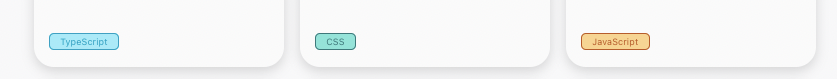
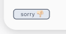

# GitHub Profiles

## How can I start the project?

it's not difficult. Follow the steps:

1. Clone this repository,

```
$ git clone https://github.com/SallesCosta/gh-ch-ls.git
```

2. Once inside the directory, you can run `yarn`
and wait a few seconds until the project dependencies are installed.

3. Then run `yarn dev` then go to [localhost](http://localhost:3000) and voilà!

  In this project we can find Github users and their repositories with some information.
Not all data from the repositories may be available, but we have the link to them.
Something important about the GitHub API is that it allows a limited number of requests in a period of time. This can be a problem when implementing tests.
With the following code: 

```
const get = (url) => {
  return fetch(url, {
    headers: {
      authorization: process.env.GH,
      accept: 'application/vnd.github.v3+json',
    },
  })
}

```
the limit will increase considerably. In this function, `GH` is my access token to GitHub and is set in a file called `.env.local`. If you don't want to set your GitHub user token, You just keep the code how it is:

```
const get = (url) => {
  return fetch(url)
}

```


You only have to write the name in the input-text, if there is a user with that name you will be redirected to the UserPage.
In UserPage there is a 'back to SearchPage' button.
For each repository we can see the main language used in this project that the [Github API](https://api.github.com) provides to us.
I registered some different languages and assigned colors to each one. Background and border.
The color chosen on the border will also be used for the 'color' attribute.



If the repository has no specified language, the following tag will be displayed:



> This is very common.

This same tag will be displayed if the repository contains a language that is not registered.
Please Pull Request to expand this list of languages colored dynamically.

# Testing

### E2E | Cypress

#### How?

On terminal run `yarn test:e2e`. It will open the Cypress with the tests I did. So it's a good opportunity for PR again. Feel free to.

Any questions? Any suggestions? We can talk about.

Thank you for reading up to this point.

### #Opensource
